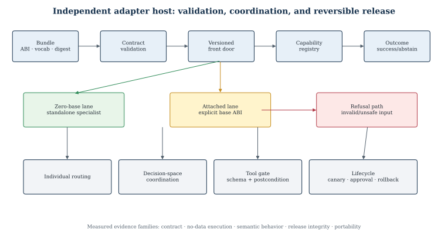
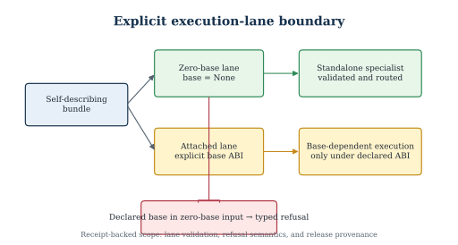

# Zero-Base LoRA Adapters for Governed Edge Execution with Typed Routing and Abstention

## Abstract

Parameter-efficient adapters are normally residual updates applied to a pretrained backbone. This paper studies an alternative deployment contract: a compact adapter-format artifact that is executable without a hidden pretrained base, external model download, or network service. We present Tiny Wonder, an independent edge host for self-describing `lora_zb0` adapter modules. The host validates adapter identity, tensor layout, vocabulary, integrity hashes, lane compatibility, and capability declarations before execution. It combines individual routing with bounded decision-space augmentation, closed-schema tools, semantic postconditions, abstention, cancellation, replay protection, candidate promotion, rollback, and an explicitly separate attached-model lane. It also measures a CPU page-permission transport primitive with repeated p50/p99 timing, while keeping that microbenchmark distinct from end-to-end model-serving latency. A fresh copied-bundle reproduction validated six zero-base adapter modules, base-injection refusal, clean no-data execution, fixture-gated semantic tools, and release integrity; a second CPU host reproduced the bundle contract, while a separate native evaluation replicated the qualitative LoRA-stacking result reported in the companion empirical study. These results establish a bounded systems conjunction—self-contained zero-base adapter modules plus governed decision-space execution, reproducible release, and measured low-level transport—not universal language quality, general intelligence, or novelty for schemas, routing, abstention, provenance, or page-permission primitives in isolation.

Keywords: zero-base adapters; parameter-efficient models; edge AI; tool grounding; abstention; reproducible release; governed inference

## 1. Introduction

Adapter serving is usually defined relative to a pretrained model: an adapter contributes a low-rank update while the backbone supplies the computation graph, tokenizer, vocabulary, and base parameters. This dependency is convenient for large-model serving, but it creates a deployment boundary for small offline devices. An adapter artifact is not independently executable unless the host, base, tokenizer, tensor topology, and runtime are all available and compatible.

We investigate a different systems contract. The zero-base lane treats a compact adapter-format artifact as the complete adapter module, with an identity-style residual architecture, embedded vocabulary metadata, and an explicit runner. The goal is not to claim that a small adapter replaces a general language model. The goal is to determine whether such artifacts can be hosted, routed, composed, governed, and released as independently verifiable edge components.

The system is evaluated as a bounded host rather than as a universal conversational model. Its primary outputs are typed decisions, structured tool proposals, abstentions, and receipts. A separate attached lane handles conventional base-dependent adapters and requires an explicit base ABI. This separation prevents a base-dependent artifact from being silently reclassified as zero-base.

The contributions are:

1. a self-describing base-free adapter contract with integrity, vocabulary, tensor, lane, and capability validation;
2. a single operator front door for individual, stack, and augmentative adapter module execution;
3. governed tool and release semantics covering semantic validation, abstention, cancellation, replay, approval, promotion, rollback, and restart reuse;
4. an artifact-backed evaluation that separates structural validity, semantic tool behavior, safety abstention, release integrity, and portability boundaries;
5. a reproducible CPU page-permission transport measurement reported as a low-level systems primitive, not as end-to-end serving latency.

## 2. Related Work

LoRA [1] and subsequent parameter-efficient methods assume a pretrained model. Multi-tenant serving systems such as S-LoRA [2], Punica [3], vLLM's LoRA serving path [4], and PEFT hotswapping [5] make adapter selection and residency efficient, but their adapters remain deltas applied to a base model. Punica's SGMV kernel batches different LoRA requests over a shared backbone; vLLM supports per-request and dynamic adapter serving over an enabled base model. These systems are direct prior art for multi-LoRA serving, not for the zero-base lane studied here. AdapterFusion [6] composes task adapters through a fusion mechanism, again within a backbone-dependent architecture.

The present work is narrower and different: the zero-base artifact is the complete adapter module for its declared lane. The contribution is therefore not multi-LoRA serving, CUDA batching, manifest metadata, schema validation, routing, or rollback in isolation. It is the bounded conjunction of an independently executable adapter-format lane, an explicit attached lane, typed decision-space coordination, and a governed edge host with reproducible release evidence.

Input-aware composition and token-level routing are adjacent forms of base-dependent adapter composition. LoraRetriever retrieves and composes adapters according to the input task representation [14], while token-level adaptation dynamically weights adapter contributions during inference [15]. Multi-LoRA composition methods in image generation provide a related cross-domain comparison of switching and composite inference strategies [16]. These works motivate the routing comparison but do not establish the zero-base contract studied here.

Structured tool outputs are established by JSON-Schema constrained generation and systems such as XGrammar [7]. BFCL [8], When2Call [9], AgentDojo [10], and related tool-use evaluations show that syntactic validity, tool selection, abstention, and semantic argument correctness are distinct measurements. We adopt that separation rather than treating parseable JSON as successful tool use. Similarly, supply-chain systems such as in-toto [11] and SLSA [12] motivate content-addressed artifacts, ordered verification, and trusted provenance. Tiny Wonder applies these established ideas at the adapter and release boundary; the paper claims their integration with the zero-base lane, not their invention.

### 2.1 Novelty boundary

The novelty claim is deliberately conjunctive and search-bounded. Existing work covers base-dependent adapter serving, structured tool schemas, abstention benchmarks, routing, and provenance separately. The local contribution is the tested interaction of self-contained zero-base adapter modules, a strict attached-lane boundary, typed capability coverage, semantic postconditions, replay/cancellation controls, and approval-bound reversible release. No universal absence or “first” claim is made.

## 3. Research Questions

RQ1. Can a compact adapter-format artifact execute without a pretrained base, hidden model download, or network dependency?

RQ2. Can multiple adapter modules cooperate through typed decision-space proposals without silently dropping requested capabilities?

RQ3. Can structured tools and unsupported requests produce semantic success or explicit abstention rather than merely parseable output?

RQ4. Can candidate learning and release be made reproducible, replayable, approval-bound, and reversible?

## 4. Materials and Methods

### 4.1 Zero-base artifact contract

Each zero-base bundle declares a schema version, adapter identifier, lane, architecture, tensor ABI, dimensions, layer count, rank, tokenizer/vocabulary identity, capability identifiers, and weight digest. The loader rejects non-zero-base declarations, missing or inconsistent tensor shapes, incompatible vocabulary, unsafe names, path escapes, symlinks, and integrity mismatches.

The attached lane uses a separate base ABI containing architecture, vocabulary, tensor topology, and base identity. A base-dependent adapter is rejected by the zero-base lane rather than silently converted.

### 4.2 Host and front door

The public command-line front door is the single operator entry point. Requests enter a versioned envelope containing the request identity, lane, adapter set, capability requirements, resource budget, permissions, and result/abstention state. A registry resolves adapter modules and produces typed capabilities. The augmentative coordinator receives bounded adapter module proposals, summarizes outputs without storing raw contributor text in event payloads, accounts for requested/provided/contributing/abstaining/skipped capabilities, and refuses omitted capability coverage.

### 4.3 Tool execution and abstention

The evaluated tool surface is closed and schema-defined [7]. Arguments are extracted and validated before execution. Semantic postconditions are checked after execution. Unsupported tools, unknown intents, malformed inputs, and insufficient evidence produce explicit abstention or rejection. The system does not infer general tool competence from schema validity; this distinction follows the evaluation concerns formalized by BFCL, When2Call, and AgentDojo [8–10].

### 4.4 Lifecycle and release

Learning follows candidate staging, evaluation, canary, explicit approval, promotion or rollback, restart/reuse, and corruption refusal. Provenance and release integrity follow established supply-chain patterns [11,12], while the local implementation binds candidate, canary, recovery, policy, evaluator, target, and approval digests. A candidate-specific canary loads the staged artifact by file path and executes its lifecycle branch. Mutation stages rollback bytes and modes before atomic replacement and restores them if postconditions fail.

### 4.5 Comparators and ablations

The host study uses contract-level comparators rather than a large-model quality leaderboard. The primary comparisons are zero-base versus attached-lane execution, clean copied-bundle versus fixture-bearing evaluation, valid versus declared-base input, supported versus unsupported tool requests, and individual versus augmentative coordination. These comparisons isolate lane enforcement, fixture dependence, semantic abstention, and capability accounting. They do not establish broad language-model quality.

### 4.6 Page-permission transport benchmark

A separate low-level benchmark allocates anonymous 1-MiB regions and toggles their POSIX page permissions with `mprotect` [13]. It repeats five 2,000-iteration runs for one, two, four, and eight regions, reporting p50/p90/p99 per-iteration timing for a full cycle and for a two-region single switch. The benchmark measures permission transitions only; it does not load model weights, generate tokens, or establish end-to-end adapter-serving latency.

### 4.7 Evaluation

The release evidence combines the original bounded closure with a fresh copied-bundle reproduction. The fresh reproduction exercises:

- six zero-base adapter contracts, embedded vocabularies, tensor metadata, and weight hashes;
- six zero-base load-and-generate checks with `base=None`;
- poisoned-base refusal and bundle restoration;
- front-door version, capability, validation, routing, structured execution, release, air-gap, and hash checks;
- a no-data front-door run in the clean bundle;
- data-dependent probes in a separate hash-verified fixture-bearing bundle;
- repeated timeout-behavior runs on the local host and fresh copied bundles.

The original release closure additionally exercised an attached GPT-2 compatibility fixture, augmentative checks, cancellation, replay, cache invalidation, authenticated delegation, When2Call, BFCL, release rollback, and receipt verification. The external semantic evaluation is a bounded sample and is not a leaderboard result.

Figure 1 summarizes the host architecture and the separation between the zero-base and attached lanes. Figure 2 isolates the lane contract and its refusal behavior.

## 5. Results

The independent-host release evaluation passed its declared front-door, compatibility, release, air-gap, and hash checks. A fresh clean copied bundle then passed all six zero-base contracts, all six load-and-generate checks, poisoned-base refusal, and bundle restoration. Its no-data front door completed successfully; the two data-dependent probes passed in a separate fixture-bearing bundle and were not used to evaluate the no-data bundle.

The final evaluation comprised 14 declared checks; one optional external-transport test was not applicable because its external root and adapter fixtures were not supplied. A separate post-mitigation timeout study recorded ten local runs and three fresh copied-bundle runs, all with the same logical verdict, zero SIGABRT exits, and no stderr; the pre-mitigation baseline remains recorded as two aborts in 18 copied-bundle runs during interpreter teardown.

The zero-base family compatibility receipt validated six live adapter modules with embedded lane, format, tensor, tokenizer, dimension, layer, rank, and weight-hash fields. The attached fixture executed only under its declared base ABI.

The augmentative evaluation suite passed 83 of 83 checks, including typed event allowlists, raw-output exclusion, capability coverage, stable replay digest, hot load/unload isolation, deadline attribution, malformed proposal refusal, and attached-lane refusal in the zero-base lifecycle.

External semantic evaluation completed without internal errors. Six supported BFCL rows passed exact scoring [8]; eighteen unsupported BFCL rows abstained safely. All 24 When2Call rows satisfied the recorded safe-abstention criterion [9]. These results demonstrate bounded decision/tool behavior, not universal semantic competence.

Table 1 summarizes the principal evidence planes.

| Evidence plane | Result | Interpretation |
|---|---:|---|
| Zero-base adapter contracts | 6/6 | Self-contained bundles validated |
| Augmentative protocol checks | 83/83 | Typed coverage and refusal behavior passed |
| BFCL supported rows | 6/6 exact | Bounded supported-tool semantics |
| BFCL unsupported rows | 18/18 abstained | Unsupported capability refusal |
| When2Call rows | 24/24 safe | Bounded call/abstain decisions |
| Release checks | 14/14 | Artifact and lifecycle checks passed |

The page-permission benchmark produced the following repeated distributions. Full-cycle cost rises with the number of regions because every iteration changes each region's permission; the pairwise mode isolates two permission changes per iteration. These values are microbenchmark measurements, not model-serving throughput.

| Transport mode | Regions | p50 (µs/iteration) | p99 (µs/iteration) |
|---|---:|---:|---:|
| Full cycle | 1 | 1.7991 | 1.8945 |
| Full cycle | 2 | 7.8083 | 7.8888 |
| Full cycle | 4 | 11.5165 | 15.2816 |
| Full cycle | 8 | 19.3727 | 20.4299 |
| Pairwise switch | 1 | 5.6899 | 7.4913 |
| Pairwise switch | 2 | 7.5633 | 9.7210 |
| Pairwise switch | 4 | 7.8696 | 9.0340 |
| Pairwise switch | 8 | 8.1403 | 10.6638 |

*Table 2. Five repeated runs of 2,000 iterations per condition on the measurement host. The table reports page-permission transition cost only.*

*Figure 1. The zero-base host validates self-contained bundles before routing. The attached lane is explicit and base-dependent; the two lanes are not silently interchanged.*

*Figure 2. A declared base in a zero-base bundle is refused rather than converted. A valid zero-base bundle proceeds without a pretrained backbone.*

## 6. Discussion

### 6.1 Answers to the research questions

The four research questions are answered at the level of the evaluated release contract rather than at the level of unrestricted language generation.

**RQ1: Can a compact adapter-format artifact execute without a pretrained base, hidden model download, or network dependency?** Within the declared zero-base lane, yes. Six self-describing adapter contracts passed lane, tensor, vocabulary, capability, and integrity checks. The fresh copied-bundle evaluation loaded six zero-base artifacts with `base=None`, rejected a poisoned or declared-base input, and completed the clean no-data front-door path without relying on a hidden model download or network service. This establishes independent execution for the evaluated artifact family; it does not establish that arbitrary LoRA files or arbitrary language models can be made base-free.

**RQ2: Can multiple adapter modules cooperate through typed decision-space proposals without silently dropping requested capabilities?** The augmentative protocol passed all 83 declared checks. The relevant evidence is not a fluency score: it is the preservation of requested, provided, contributing, abstaining, and skipped capability accounting, together with refusal when required coverage is omitted. The result supports a governed coordination protocol for the tested closed surface. It does not show that arbitrary combinations of weak modules will produce useful open-ended text.

**RQ3: Can structured tools and unsupported requests produce semantic success or explicit abstention rather than merely parseable output?** The bounded semantic evaluation gives separate outcomes for supported and unsupported cases: 6/6 supported BFCL rows passed exact scoring, 18/18 unsupported BFCL rows abstained safely, and 24/24 When2Call rows satisfied the safe-abstention criterion. These results show that the host distinguishes schema validity, semantic postconditions, and abstention. They are not a general tool-use accuracy result.

**RQ4: Can candidate learning and release be reproducible, replayable, approval-bound, and reversible?** The release lane passed its declared 14-check receipt, including artifact integrity, clean-bundle behavior, release readback, and lifecycle controls, with one optional foreign-transport row classified as not applicable. The broader lifecycle evidence includes candidate staging, canary evaluation, explicit approval, promotion or rollback, restart/reuse, and corruption refusal. This supports the release contract for the tested implementation; it does not prove autonomous improvement or safe promotion for arbitrary generated candidates.

### 6.2 What the zero-base boundary changes

Conventional LoRA treats the adapter as a delta whose meaning depends on a frozen backbone. The zero-base contract moves part of that meaning into the artifact itself: the adapter declares its lane, tensor ABI, vocabulary identity, dimensions, capabilities, and weight digest. The host therefore validates not only whether a file can be parsed, but whether it is the artifact it claims to be and whether it belongs to the requested execution lane.

This changes the unit of portability. A portable zero-base module is not merely a small file; it is a file plus the vocabulary, tensor layout, runner assumptions, capability declarations, and integrity evidence needed to reproduce its declared behavior. The attached lane remains useful for conventional base-dependent adapters, but it is kept explicit so that a missing or incompatible base cannot be silently supplied by a fallback path.

The distinction also changes what counts as a successful negative result. Refusing a declared base in the zero-base lane is not a failed generation attempt; it is evidence that the lane boundary is enforced. Similarly, abstaining from an unsupported tool request is preferable to producing a syntactically valid but semantically unverifiable action.

### 6.3 Governance is part of the measured system

The host's contribution is not the invention of manifests, schemas, routing, or rollback individually. Those mechanisms have substantial prior art. The measured systems contribution is their interaction with a self-contained adapter lane and an explicit attached lane. The request envelope binds the lane, adapter set, capability requirements, permissions, and resource budget before execution. The result records either a verified outcome or a typed abstention/rejection. Learning observations are admitted only after semantic and provenance checks, and release mutation is bounded by approval and rollback state.

This ordering matters because a zero-base artifact can be structurally valid while still being semantically weak, incompatible with the requested capability, or unsafe to reuse after a reload. The evaluation therefore separates artifact checks, semantic checks, release checks, and portability checks rather than collapsing them into one pass/fail number.

### 6.4 Deployment implications

The contract is most useful where a small offline device needs a controlled collection of narrow modules rather than a general cloud model. The page-permission benchmark suggests that a low-level memory-protection transition can be measured independently of model-serving latency, but it does not establish that model weights can be hot-swapped safely in every runtime. The appropriate deployment question is therefore whether the complete module, runner, vocabulary, and release policy fit the device's resource envelope—not whether one microbenchmark number resembles token throughput.

The current evidence supports a practical architecture for local specialist hosting, typed decision making, and fail-closed tool proposals. It does not support claims of general conversational quality, unrestricted external action, or universal zero-base language generation.

## 7. Failure Analysis and Negative Results

### 7.1 Base-injection refusal

The strongest negative control is a request that supplies a base model to the zero-base lane. The loader and front door reject this input before it can be treated as a zero-base artifact. This prevents a hidden fallback from turning an attached-model success into a false zero-base result. The rejection is typed and receipt-backed, so downstream evaluation can distinguish policy refusal from an execution crash.

### 7.2 Missing fixtures and applicability

Two data-dependent smoke checks fail when run in a deliberately clean no-data bundle because their declared task fixtures are absent. The same checks pass in a separate fixture-bearing test bundle. The correct interpretation is not that the clean bundle failed or that the model failed; the checks are not applicable to the no-data artifact. The clean-bundle front door is the appropriate no-data acceptance test, while the fixture-bearing bundle is a separate applicability lane.

This distinction prevents a test harness from manufacturing a pass by silently adding data to a supposedly clean package. It also prevents a missing-input condition from being reported as a semantic model failure.

### 7.3 Unsupported tools and semantic abstention

The external semantic evaluation includes unsupported requests intentionally. The system abstains rather than inventing arguments, invoking an unavailable side effect, or treating parseable JSON as proof of tool competence. The supported BFCL rows and unsupported BFCL rows are therefore reported separately. This is a safety and measurement boundary, not merely an error-handling detail.

### 7.4 Timeout teardown behavior

The early timeout-gate implementation exposed a process-lifecycle failure: the logical verdict was flushed and indicated success, but abandoned worker teardown could trigger an interpreter-shutdown abort. A minimal reproduction isolated the failure to daemon-worker teardown rather than to the timeout verdict itself. The bounded mitigation preserves the gate logic, flushes the terminal result, and exits through the validated process path. Ten mitigated runs completed without SIGABRT; the earlier cold-copy reproduction retained two aborts in 18 pre-mitigation runs. The result is a useful distinction between logical gate status and process exit status.

### 7.5 Isolation escape in the first copied bundle

The first isolated Paper 1 bundle exposed a genuine packaging defect: adapter symlinks resolved toward canonical-tree paths, and the foreign-transport demonstration contained hard-coded canonical roots. This was recorded as a failure, not rounded to a pass. A subsequent clean bundle dereferenced the adapter files, removed historical experiment material, made the package-demo root relative to the bundle, and was independently verified on a second CPU host with zero symlink escapes, zero Python canonical-root references, zero runtime canonical-path hits, and 16/16 applicable checks passing. The foreign-payload lane remained not applicable because its payload was not supplied.

The repaired bundle demonstrates the corrective boundary, but the original defect remains part of the release history and is preserved as negative evidence.

## 8. Limitations and Threats to Validity

The evidence has seven important limitations.

1. **Bounded artifact family.** The zero-base result covers six declared modules and their copied-bundle contract. It does not establish compatibility for arbitrary LoRA checkpoints, architectures, tokenizers, or vocabularies.

2. **Semantic-generation boundary.** Generic zero-base text generation remains a negative or fail-closed lane on the tested probes. The positive results concern structured decisions, tool proposals, abstention, and release behavior, not broad natural-language quality.

3. **Training and statistical independence.** The adapter family and control results do not constitute independent adapter-training repetitions across seeds. Fixed-seed or deterministic replay demonstrates transport and repeatability, not population-level generalization.

4. **Host and operating-system coverage.** The main release evidence is local, with a second CPU-host copy and front-door verification. The second host does not establish fleet-wide deployment, cross-host absolute metric equivalence, or portability to other operating systems.

5. **Optional foreign transport.** The foreign transport lane is fixture-gated and was not part of the clean zero-base release claim. When the required foreign payload is absent, the correct status is not applicable. When a copied bundle resolves a canonical path, the result is a packaging failure requiring repair.

6. **Low-level benchmark scope.** The page-permission measurements characterize `mprotect` transitions on anonymous regions. They do not establish end-to-end token latency, safe model-weight hot swapping, memory pressure behavior, or serving throughput.

7. **Release and security scope.** The manifest, path, symlink, approval, rollback, and receipt checks cover the evaluated front door and release lane. They do not remove the need for independent audits of every optional or legacy subsystem, nor do they prove that a future generated candidate is safe to promote.

These limitations define the supported claim: a bounded, receipt-backed zero-base adapter-hosting and governed-execution contract, not a universal model, universal adapter format, or unrestricted autonomous system.

## 9. Reproducibility and Artifact Availability

The public release should contain the two manuscript sources, the declared adapter manifests, the six zero-base artifact declarations and weights where redistribution is permitted, the attached-lane compatibility fixture, the closed tool schemas, the clean-bundle setup inventory, the evaluator configuration, the raw result rows needed to regenerate tables, and the sanitized figure data. The release manifest binds each load-bearing artifact to a stable identifier, byte hash, configuration digest, host/architecture tag, software/backend version, dataset or prompt-set identity, raw-result location, and derived-table generator.

A reproduction should proceed in this order:

1. verify the release manifest and all artifact hashes;
2. confirm the clean-bundle inventory before any gate runs;
3. run the zero-base contract and six-adapter compatibility checks;
4. run the no-data front door without adding fixtures;
5. run fixture-dependent semantic checks only in the declared fixture lane;
6. run the release, replay, rollback, and corruption-refusal checks;
7. regenerate the tables and figures from the raw rows and sanitized data file;
8. record host, interpreter, backend, command arguments, exit code, and log hash for every run.

The public package must exclude private workspace paths, credentials, agent transcripts, provider metadata, and unrelated project artifacts. Operational receipts can retain those details outside the manuscript package, while the paper reports the method and evidence boundary in reader-facing terms.

## 10. Conclusion

This study establishes a bounded zero-base LoRA adapter contract for governed edge execution. Six declared adapter modules were validated as self-describing artifacts, loaded in the zero-base lane, and checked against vocabulary, tensor, lane, capability, integrity, and base-injection constraints. The host also provides typed routing, decision-space coordination, structured tool postconditions, explicit abstention, replay/reuse, candidate lifecycle controls, and content-addressed release evidence.

The results answer four narrower questions. A compact module can execute without a hidden pretrained base within the evaluated artifact family. Multiple modules can cooperate through a typed coordination protocol without silently discarding requested capabilities in the tested surface. Supported and unsupported tool requests can be separated into semantic success and explicit abstention. Candidate and release behavior can be made reproducible and reversible within the evaluated lifecycle.

The evidence does not establish universal language quality, unrestricted tool use, arbitrary cross-architecture compatibility, universal portability, or general intelligence. The page-permission benchmark is a low-level transport measurement, not a serving-throughput claim. The correct scientific conclusion is therefore an engineering one: zero-base adapter modules can be packaged, validated, routed, governed, and reproduced as explicit edge-execution artifacts when their lane, ABI, vocabulary, capabilities, and evidence are made part of the release contract.

## References

[1] Hu et al. “LoRA: Low-Rank Adaptation of Large Language Models.” arXiv:2106.09685.

[2] Sheng et al. “S-LoRA: Serving Thousands of Concurrent LoRA Adapters.” arXiv:2311.03285; MLSys 2024.

[3] Chen et al. “Punica: Multi-Tenant LoRA Serving.” arXiv:2310.18547; MLSys 2024. https://arxiv.org/abs/2310.18547. Implementation: https://github.com/punica-ai/punica.

[4] vLLM. “LoRA Adapters.” Official documentation, https://docs.vllm.ai/en/latest/features/lora/.

[5] Hugging Face PEFT. “Hotswap Adapter.” Official documentation, https://huggingface.co/docs/peft/en/package_reference/hotswap.

[6] Pfeiffer et al. “AdapterFusion: Non-Destructive Task Composition for Transfer Learning.” EACL 2021, arXiv:2005.00247.

[7] Xia et al. “XGrammar: Flexible and Efficient Structured Generation Engine for Large Language Models.” arXiv:2411.15100.

[8] Patil et al. “The Berkeley Function Calling Leaderboard (BFCL): From Tool Use to Agentic Evaluation of Large Language Models.” ICML 2025, PMLR 267, pp. 48371–48392. https://proceedings.mlr.press/v267/patil25a.html.

[9] Ross, Mahabaleshwarkar, and Suhara. “When2Call: When (not) to Call Tools.” NAACL 2025, pp. 3391–3409. https://aclanthology.org/2025.naacl-long.174/.

[10] Debenedetti et al. “AgentDojo: Dynamic Environment for Prompt Injection Attacks and Defenses.” NeurIPS 2024, arXiv:2406.13352.

[11] Torres-Arias et al. “in-toto: Providing Farm-to-Table Guarantees for Bits and Bytes.” USENIX Security 2019.

[12] SLSA v1.2 Specification. https://slsa.dev/spec/v1.2/.

[13] Linux man-pages project. “mprotect(2) — set protection on a region of memory.” https://man7.org/linux/man-pages/man2/mprotect.2.html.

[14] Zhao et al. “LoraRetriever: Input-Aware LoRA Retrieval and Composition for Mixed Tasks in the Wild.” arXiv:2402.09997. https://arxiv.org/abs/2402.09997.

[15] Belofsky. “Token-Level Adaptation of LoRA Adapters for Downstream Task Generalization.” arXiv:2311.10847. https://arxiv.org/abs/2311.10847.

[16] Zhong et al. “Multi-LoRA Composition for Image Generation.” arXiv:2402.16843. https://arxiv.org/abs/2402.16843.
