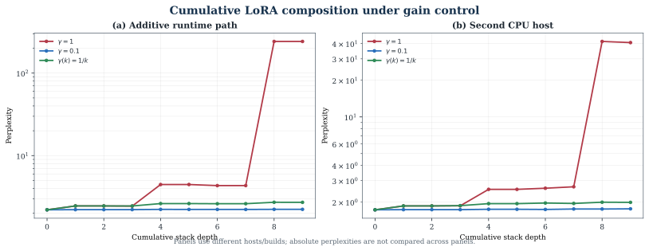
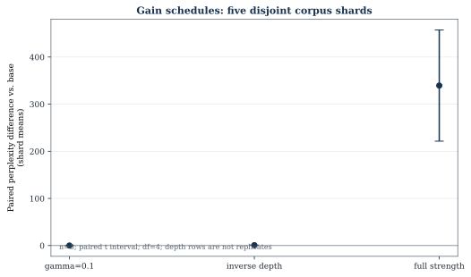
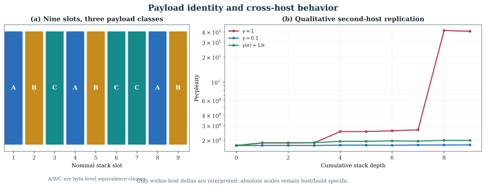
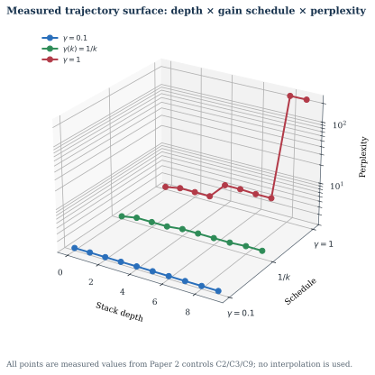

# Cumulative LoRA Stacking on CPU-Only Edge Hardware
## Runtime Collapse, Tensor-Merge Stability, and Stack-Position Gain Control

### Abstract

We study cumulative multi-adapter LoRA composition at the small-model edge scale. Using a 135M-parameter anchor model and CPU-only evaluation, we compare additive runtime loading of GGUF-LoRA adapters with tensor-level merging of adapter deltas. Fresh controls show that a constant `gamma=0.1` schedule keeps the additive path close to baseline but still produces a small measurable degradation, whereas inverse-depth scaling reduces severe full-strength degradation without eliminating it. Same-protocol merge baselines, corpus-shard confidence intervals, adapter-order permutations, and byte-level payload analysis show that the nominal nine-slot stack contains only three distinct payloads and that cumulative depth rows are trajectories rather than independent replicates. The results are bounded to one host, one 135M anchor, specified controls, and separate evaluator scales. The contribution is an empirical edge-scale characterization of gain control and measurement confounds, not a universal theory of LoRA interference or a claim that depth-indexed attenuation is entirely novel.

Keywords: LoRA; adapter composition; edge inference; CPU-only inference; gain control; model merging; parameter-efficient adaptation

## 1. Introduction

LoRA enables parameter-efficient adaptation by adding low-rank updates to a frozen model [1]. A practical deployment may need several skills at once, but composition can be implemented in more than one way. Runtime adapter loading composes transformations over activations, whereas tensor-level merging folds deltas into one set of weights. These paths are often discussed together even though they can have different numerical behavior.

Existing work studies task arithmetic [2], interference-aware merging [3,4,6,8–11], adapter fusion [5], rank scaling [12], and multi-tenant serving [19–21]. Recent sequential and layered composition studies are discussed separately below [13–15,22–24].

The paper makes three bounded contributions:

1. a two-path measurement at a 135M edge-scale anchor;
2. a depth-dependent gain-control experiment over cumulative stacks;
3. per-adapter probe measurements that expose the tradeoff between contextual retention and specialist amplitude.

We do not claim that the observed behavior is universal, that attenuation is the only explanation, or that the projection method used to create a mixed adapter corpus is novel.

## 2. Related Work

Task Arithmetic [2] established vector addition as a model-composition baseline. TIES-Merging [3], DARE [4], and subsequent methods identify sign conflict, redundancy, and interference as practical problems. AdapterFusion [5] composes adapters through a learned fusion mechanism. MoLE [6], LoraHub [7], LoRA Soups [8], GLAM [9], STABLE [10], and TaDA [11] use learned or calibrated coefficients, normalization, or layer-dependent weighting. rsLoRA [12] studies stability of the rank scaling factor itself.

Cumulative and multi-adapter composition are established prior art. Naive LoRA summation at GPT-2 scale [13] reports mixed pairwise outcomes and examines when simple addition works; Stacked LoRA [14] studies additive frozen adapters for continual-learning retention; and LoRA-memory work [15] measures capacity and multi-module behavior. READ [22] studies read-only directional coupling for sequential adapter expansion, PRM [23] studies proximal shaping of task vectors before merge, and LILAC [24] composes independently trained adapters through a layered inference protocol without weight merging. The present distinction is the paired comparison of runtime additive loading and tensor merge at small CPU edge scale, together with stack-position-indexed schedules, payload-identity controls, and qualitative second-host replication.

Input-aware retrieval and token-level routing provide additional composition baselines: LoraRetriever [25] retrieves adapters according to the input task representation, while token-level adaptation [26] changes the adapter mixture during inference. Multi-LoRA Composition [27] provides an adjacent image-generation comparison of switching and composite inference. These works are related composition baselines, not evidence that the present CPU/135M measurements generalize across domains.

Cross-architecture projection is established by Cross-LoRA [16], LoRA-X [17], ProLoRA [18], and related activation-manifold methods. In this study projection is an enabling procedure, not a contribution. Multi-LoRA serving systems such as S-LoRA [19], Punica [20], and dLoRA [21] address adapter residency and scheduling rather than cumulative depth stability.

## 3. Research Questions

RQ1. Do additive runtime loading and tensor-level merge exhibit different stability curves as cumulative adapter depth increases?

RQ2. Can stack-position gain schedules prevent the observed additive-path instability?

RQ3. Does attenuation preserve specialist behavior, and what stability/strength tradeoff does it introduce?

## 4. Materials and Methods

### 4.1 Anchor and adapter corpus

The anchor is SmolLM2-135M-Instruct with hidden dimension 576, 30 layers, grouped-query attention, and intermediate size 1536. The adapter corpus includes native and projected adapters from multiple model families. Cross-architecture projection uses SVD subspace alignment, layer remapping, and grouped-query key/value mapping. Projection success is reported as an engineering prerequisite; downstream capability preservation is not inferred from load success.

### 4.2 Composition paths

The additive runtime path loads GGUF-LoRA adapters through llama.cpp’s scaled-LoRA interface. Each adapter acts on the modified activation produced by preceding adapters.

The tensor-level path computes a delta from each adapter’s low-rank factors and adds the scaled delta to the anchor weights before a single forward pass. The resulting model is evaluated without runtime adapter composition.

The paths use different software stacks and perplexity scales. Additive measurements use llama.cpp/LCC; merge measurements use the transformers-scale evaluator. Numerical values are reported within path and are not compared directly across scales.

### 4.3 Gain schedules

The tested schedules are:

- full strength: `gamma(k)=1`;
- inverse depth: `gamma(k)=1/k`;
- inverse square root: `gamma(k)=1/sqrt(k)`;
- exponential decay: `gamma(k)=0.8^k`.

Here, `k` is cumulative stack position, not transformer layer depth. This distinction is essential because layer-dependent weighting has separate prior art [11].

### 4.4 Evaluation

Fluency is measured by perplexity on a fixed facts-domain passage. Per-adapter behavior is measured with four specialist prompts, greedy decoding, input representation cosine against the anchor, and a task-output probe. Existing measurements contain a small prompt count and a short token budget; these limitations are carried into the claims.

Confidence intervals use paired differences across five disjoint 40-line corpus shards, with a paired t interval at 95% confidence (`n=5`, `df=4`, `t*=2.776`). Cumulative depth rows are trajectories, not independent replicates. Three seed checks were identical and therefore do not provide a non-degenerate run-to-run variance estimate. The additive and tensor-merge evaluators use different metric scales; their absolute PPL values are never combined.

### 4.5 Baselines and statistical analysis

The additive controls compare full strength, constant `gamma=0.1`, and inverse-depth schedules on the same host, corpus, adapter order, and evaluator. The tensor-merge controls compare the same schedules with TIES, DARE, and task arithmetic under the same merge evaluator. Adapter-order permutations and payload-identity analysis are treated as ablations, not independent replications. Confidence intervals use paired differences across five disjoint 40-line shards (`n=5`, `df=4`, `t*=2.776`); cumulative depth rows are never used as replicate units.

## 5. Results

### 5.1 Additive runtime path

Figure 1 shows the three local additive trajectories on a log PPL axis. The full-strength path has a discontinuity at depth eight; the two gain controls remain in the low-PPL regime.

The new control campaign confirms that the gain parameter is active on the local llama.cpp build. A constant `gamma=0.1` schedule keeps the additive trajectory close to the base on the tested host and corpus: the paired shard difference at the evaluated endpoint is +0.0547 perplexity, with a 95% confidence interval of [0.0390, 0.0703] across five disjoint 40-line shards. This is a small but detectable degradation, not parity.

Inverse-depth scaling reduces the severe full-strength degradation but does not preserve the base. Its paired endpoint difference is +0.8004, with a 95% interval of [0.6807, 0.9201]. The full-strength constant schedule is much worse (+339.4761, 95% interval [221.5794, 457.3727]) under the same shard protocol. The confidence intervals are based on corpus shards, not cumulative depth rows.

*Figure 1. Local additive and tensor-merge trajectories are shown in separate panels because their evaluators and absolute PPL scales differ.*

### 5.2 Tensor-level merge path and baselines

The equal-protocol tensor-merge path gives a base perplexity of 2.630855 on its evaluation scale. The `gamma=0.1` control reaches 2.657793, while inverse-depth reaches 3.573302. Standard merge baselines expose the importance of the comparison set: TIES [3] at 0.2 reaches 2.741819 and at 0.5 reaches 2.905892; task arithmetic [2] reaches 491.640494; DARE [4] magnitude variants are non-viable in this configuration, while DARE random 0.2 reaches 582.779405.

These values are within the tensor-merge evaluator and are not numerically comparable with the llama.cpp/LCC additive values. They establish a bounded same-protocol comparison, not a universal ranking of merge algorithms.

*Figure 2. Paired endpoint differences from the base across five disjoint corpus shards. Depth rows are not treated as replicates.*

### 5.3 Adapter order and payload identity

All six permutations of the three distinct payload classes were evaluated at depth nine under both schedules, for 12 fresh endpoint runs with zero evaluator failures. Constant-gain endpoints ranged from 240.3123 to 241.5494 (spread 1.2371; 0.515% relative to the minimum). Inverse-depth endpoints ranged from 2.2484 to 3.7333 (spread 1.4849; 66.043% relative to the minimum). The constant schedule therefore showed a small but measurable order-dependent spread in this evaluator; inverse-depth showed a larger spread because gains are assigned by position.

| Class order | Constant gain | Inverse depth |
|---|---:|---:|
| ABC | 240.3123 | 3.7333 |
| ACB | 240.3123 | 3.6608 |
| BAC | 241.3067 | 2.3021 |
| BCA | 241.5494 | 2.2484 |
| CAB | 241.1061 | 2.3080 |
| CBA | 241.1061 | 2.2498 |

*Table 3. Exhaustive endpoint results over the six permutations of the three distinct payload classes. A, B, and C each represent three byte-identical slots.*

A byte-level analysis found that the nine nominal adapter slots contain only three distinct payloads in both source and GGUF representations. Three slots (`_stack2`, `_tmp_13`, and `_tmp_21`) have exactly zero perplexity delta in the single-adapter probe. The earlier repeated adjacent depth rows are therefore partly explained by duplicate/no-op payloads. Claims about a nine-independent-adapter stack would be overstated.

### 5.4 Corpus statistics and per-adapter probes

Five disjoint 40-line corpus shards were used for confidence intervals; cumulative depth rows were treated as trajectories rather than independent replicates. Three seed checks produced the same base perplexity, 2.2046, so seed-based uncertainty is degenerate for this pipeline and is not reported as a confidence interval.

The fresh additive-path per-adapter probe covered the base plus nine single-adapter slots. Six slots had nonzero effects, while three were exact no-ops; the six active slots further grouped into two behavioral classes under the probe. This result reinforces the need to identify payload identity before interpreting cumulative depth.

The earlier four-prompt full-strength versus inverse-depth diagnostic remains a bounded retention probe: all 32 outputs changed, both regimes scored 13/16 on the heuristic firing rule, and attenuation increased input cosine at every tested depth. It is not a task-accuracy benchmark.

### 5.5 Reproduction boundary

The exact reference colon-style parser was not available on the current build: direct `--lora-scaled p:s` and repeated-colon forms were rejected. A compatibility shim accepted both legacy token forms, translated them to the current two-argument interface, and matched the native PPL/error on the 40-line smoke corpus. This verifies the intended syntax semantics, but not the missing historical binary or its original full corpus. The older absolute PPL values therefore remain legacy evidence, not a fresh cross-host replication.

### 5.6 Native second-host replication

A separate three-vCPU x86_64 Debian 11 host was evaluated with a native `llama-perplexity` binary built from the verified llama.cpp commit 77095ee0cb6382708165691dd7b4caf9d21e7745. The remote model, corpus, and nine compatible adapter files were hash-verified before execution. Twenty-eight rows completed successfully: base, constant `gamma=0.1`, inverse-depth, and full-strength `gamma=1.0` trajectories through depth nine.

Within that host and evaluator, the base was 1.7295 PPL. Full strength reached 41.6479 at depth eight, a +39.9184 delta, while constant `gamma=0.1` reached 1.7550 (+0.0255) and inverse-depth reached 1.9966 (+0.2671) at the same depth. The same qualitative collapse and attenuation pattern reproduced on the second CPU host. Absolute PPL values are not compared with the local host: the evaluator configuration, host, and run protocol differ from the earlier local measurements.

The remote run did not execute the tensor-merge path, inverse-square-root or exponential schedules, exhaustive order permutations, or skill-survival probes. It is a cross-host qualitative replication of the additive GGUF path, not fleet-wide closure.

*Figure 3. Byte-level payload classes explain repeated depth values; the second-host panel reproduces the qualitative collapse/attenuation ordering without comparing absolute PPL across hosts.*

*Figure 4. A measured three-dimensional view of the local additive controls. The axes are cumulative depth, gain schedule, and perplexity; all plotted points come directly from controls C2, C3, and C9. The 3D view is explanatory, not an additional statistical replicate.*

## 6. Discussion

The results support a narrower conclusion than “attenuation solves LoRA stacking.” On the tested CPU/135M configuration, reducing cumulative gain is an effective control for severe full-strength degradation. Constant `gamma=0.1` is the strongest tested additive control, but its confidence interval excludes zero degradation. Inverse-depth is substantially better than full strength yet still degrades the base.

The order and payload analyses change the interpretation of the original depth curves. Some apparent depth progression reflects repeated payloads or no-op slots, and inverse-depth changes the gain assigned to each position. The mechanism is therefore consistent with accumulated gain and payload duplication, while directional interference, adapter order, and architecture-specific effects remain possible.

## 7. Limitations and Remaining Evidence Gaps

The current evidence is still bounded by:

1. two CPU hosts for the additive path, with the controlled shard statistics and tensor-merge baselines on one host;
2. one 135M anchor model and one principal corpus;
3. deterministic seed checks rather than independent adapter-training repetitions; the nine GGUF payloads preserve no source-training hashes or seed metadata, and the historical PEFT/Datasets environment is not present in the current build environment;
4. exhaustive order coverage is now performed over all six permutations of the three distinct payload classes; permutations of duplicate labels are not independent experiments;
5. the historical full-corpus colon parser and original host remain unavailable, although smoke-corpus semantic compatibility passed through the shim;
6. no cross-host absolute-PPL comparison—only qualitative additive-path replication;
7. a small specialist probe set and short generation budget;
8. different metric scales for additive LCC and tensor/Hugging Face evaluation;
9. no remote tensor-merge, exhaustive permutation, or skill-survival evaluation.

The results do not support universal stability, universal transfer, or a claim that stack-position gain control is unprecedented. They support a reproducible, bounded empirical comparison with explicit payload and corpus controls.

## 8. Reproducibility

The public artifact should contain the frozen adapter manifest, evaluation inputs, evaluator version, hardware tags, backend versions, per-run raw JSON, generated tables, control receipts, payload-identity analysis, and a content-addressed manifest. Private workspace paths and internal agent metadata should not appear in the manuscript.

## 9. Conclusion

At the tested 135M CPU edge scale, additive runtime LoRA composition and tensor-level merging show different cumulative behavior. A constant `gamma=0.1` schedule keeps the additive path near baseline with a small measurable degradation, while inverse-depth attenuates severe full-strength degradation but still falls below baseline. The same qualitative additive collapse and attenuation pattern reproduces on a separately built second-host evaluator, without implying cross-host absolute-PPL equivalence. Payload identity, order assignment, corpus shards, and same-protocol merge baselines materially affect interpretation. The result is a bounded empirical characterization—not a universal theory of LoRA interference and not a claim that all composition problems are solved.

## References

[1] Hu et al. “LoRA: Low-Rank Adaptation of Large Language Models.” arXiv:2106.09685.

[2] Ilharco et al. “Editing Models with Task Arithmetic.” arXiv:2212.04089.

[3] Yadav et al. “TIES-Merging: Resolving Interference When Merging Models.” arXiv:2306.01708.

[4] Yu et al. “Language Models are Super Mario: Absorbing Abilities from Homologous Models as a Free Lunch.” arXiv:2311.03099. https://arxiv.org/abs/2311.03099.

[5] Pfeiffer et al. “AdapterFusion: Non-Destructive Task Composition for Transfer Learning.” EACL 2021, arXiv:2005.00247. https://arxiv.org/abs/2005.00247.

[6] Wu, Huang, and Wei. “Mixture of LoRA Experts.” arXiv:2404.13628; ICLR 2024.

[7] Huang et al. “LoRAHub: Efficient Cross-Task Generalization via Dynamic LoRA Composition.” arXiv:2307.13269; COLM 2024.

[8] Prabhakar et al. “LoRA Soups: Merging LoRAs for Practical Skill Composition Tasks.” COLING Industry Track 2025, pp. 644–655. https://aclanthology.org/2025.coling-industry.55/.

[9] Testa et al. “GLAM: Efficient Continual Learning at Scale via Grouped LoRA Adapter Merging.” arXiv:2509.13211. https://arxiv.org/abs/2509.13211.

[10] Hoy and Celik. “STABLE: Gated Continual Learning for Large Language Models.” arXiv:2510.16089. https://arxiv.org/abs/2510.16089.

[11] To et al. “TaDA: Calibrated Probe Gating for Task-Domain LoRA Merging.” arXiv:2606.05016. https://arxiv.org/abs/2606.05016.

[12] Kalajdzievski. “A Rank Stabilization Scaling Factor for Fine-Tuning with LoRA.” arXiv:2312.03732.

[13] Cao, Truong, and Lizarraga. “Efficient Modular Learning through Naive LoRA Summation: Leveraging Orthogonality in High-Dimensional Models.” arXiv:2508.11985. https://arxiv.org/abs/2508.11985.

[14] Patil, Sanam, and Atre. “Stacked LoRA: Isolated Low-Rank Adaptation for Lifelong Knowledge Management.” IJCNLP-AACL Student Research Workshop 2025. https://aclanthology.org/2025.ijcnl-srw.4/.

[15] Back et al. “Understanding LoRA as Knowledge Memory: An Empirical Analysis.” ICML 2026, arXiv:2603.01097. https://arxiv.org/abs/2603.01097.

[16] Xia et al. “Cross-LoRA: A Data-Free LoRA Transfer Framework across Heterogeneous LLMs.” arXiv:2508.05232. https://arxiv.org/abs/2508.05232.

[17] Porikli. “LoRA-X: Bridging Foundation Models with Training-Free Cross-Model Adaptation.” arXiv:2501.16559. https://arxiv.org/abs/2501.16559.

[18] To, Li, Huang, and Liu. “Zero-Shot Adaptation of Parameter-Efficient Fine-Tuning in Diffusion Models.” ICML 2025, arXiv:2506.04244. https://arxiv.org/abs/2506.04244.

[19] Sheng et al. “S-LoRA: Serving Thousands of Concurrent LoRA Adapters.” arXiv:2311.03285; MLSys 2024.

[20] Chen et al. “Punica: Multi-Tenant LoRA Serving.” arXiv:2310.18547; MLSys 2024.

[21] Wu et al. “dLoRA: Dynamically Orchestrating Requests and Adapters for LoRA LLM Serving.” OSDI 2024. https://www.usenix.org/system/files/osdi24_slides-wu-bingyang.pdf.

[22] Li et al. “New LoRA Skills Should Read but Never Write.” arXiv:2609.31600. https://arxiv.org/abs/2609.31600.

[23] Liu. “When the Merge Coefficient Stops Mattering: Proximity Regularized Merging for Continual LoRA Adaptation.” arXiv:2609.32332. https://arxiv.org/abs/2609.32332.

[24] Lupascu et al. “LILAC: Layer-Wise Independent LoRAs and Cascaded Conditioning for Multi-Concept Customization of Diffusion Models.” arXiv:2607.04801. https://arxiv.org/abs/2607.04801.

[25] Zhao et al. “LoraRetriever: Input-Aware LoRA Retrieval and Composition for Mixed Tasks in the Wild.” arXiv:2402.09997. https://arxiv.org/abs/2402.09997.

[26] Belofsky. “Token-Level Adaptation of LoRA Adapters for Downstream Task Generalization.” arXiv:2311.10847. https://arxiv.org/abs/2311.10847.

[27] Zhong et al. “Multi-LoRA Composition for Image Generation.” arXiv:2402.16843. https://arxiv.org/abs/2402.16843.
